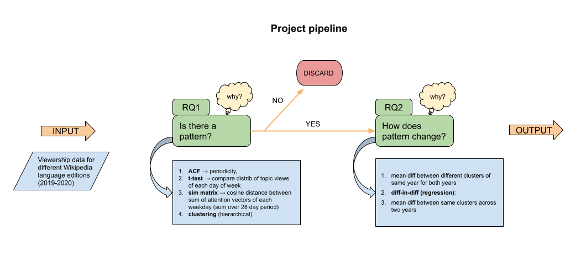

### Did covid make us lose sense of the week ? 

**Note**: In our case “change due to covid”, is actually a “change due to the mobility change caused by covid”. The beginning of the covid period and the beginning of mobility restrictions for each country will be considered to be the same in this paper. 

**You can find our datastory by clicking on the following link: https://esteller74.github.io/Website_2/.**

## Abstract: 

The whole world suffered the consequences of the covid-19 pandemic. The daily life of people and their habits were changed abruptly by the (mobility restricting) sanitary measures put in place in different countries. Before covid, work and leisure defined the different days of the week, creating a certain pattern, which, as we’ll find out, had a periodicity of a week. Now, the interesting question is whether the covid-19 pandemic made us lose sense of this typical week. In other words, what we want to see is if there was a pattern initially, how did it change during covid. Wikipedia is known to be a relatively good measure of people’s search queries and computers and phones are increasingly defining people’s lives. Wikipedia viewership thus has the potential to enlighten us on the changing habits of people as mobility restrictions due to covid happened. We all have a feeling that our routines changed but can we prove it? And can we quantify it?

Our project follows the following pipeline: 

## Research Questions: 
- RQ1: Are there Wikipedia viewing habits (patterns) during a normal year (year without covid)?
- RQ2: Considering viewing habits vary from work week to weekends (this could be more complex and will be better defined after answering RQ1), did this pattern change during covid? And if so, how?
## Proposed additional datasets
We add a new dataframe to the ones we were given, from the csv file date_to_day_2018.csv. This dataframe contains the corresponding week days to all the dates between January, 1st, 2018 to July, 31st, 2020. This allows us to match each date to one of the seven days of the week.
## Methods
**Note**: the mobility restriction date will be the mobility changepoint found in the paper “Sudden Attention Shifts on Wikipedia During the COVID-19 Crisis”. 

### 1) RQ1: Does the week make sense pre-covid?

#### A) Is the week a pattern ? (intuition = yes)

**Method**

Compute ACF (autocorrelation function) on each set (one language, one device) during different periods to find the periodicity. Conclusions at this stage can only be drawn about the periodicity of each period but will need later stages to actually compare pre- and during covid.

#### B) How can it be grouped within the week ? (intuition = workdays/ weekend)

**Method 1 [t-test]**

Proceed with a t-test between each day of the week for the three different periods 2018-S1, 2019-S1, 2020-S1. The null hypothesis is that the two days being compared are similar in terms of pageviews. The results can be shown in a symmetric table with the p-values as coefficients. We use a threshold of 0.05 meaning that if the p-value between two days is below 0.05, we can reject the null hypothesis. This gives us an idea of the days that are quite different from each other. In this way we could create groups for as many days that are different from one another. 

**Method 2 [attention vectors and similarity matrix]**

For this method, we use attentional vectors, the same vectors from the paper provided with the Coronawiki dataset. An attentional vector represents the proportion of page views consultations per topic on a given day.

We call our time window of study the period of study (ex: 6 months). We divide this period of study into time groups (e.g.: month, half-month, three weeks,...)
Then, we compute the mean attentional vector of each week day over the weeks inside the study period. (e.g.: Monday_mean_attentional_vector_of_group1). 
Then inside each time group, we calculate euclidean distances between each attentional vector. (e.g: distance(Monday_mean_attentional_vector_of_group1,Tuesday_mean_attentional_vector_of_group1)
Next step is to compute, from the computed distances, a similarity matrix of week days for each group (weekdays are the rows and columns of the matrix). Indeed, between two week days, the smaller the distance between the respective mean attentional vectors, the more similar they are. So for a study period we will end up with one similarity matrix per group. 

Using similarity matrices, we will be able to see week patterns. In other words, we will see inside each group, which day is similar to which day and if the similarity is repeated among groups. 

Similarity matrices will also help us to choose the best group length. Indeed we will calculate similarity matrices for different group lengths. We need to think about a method to find the group length that has resulting similarity matrices with most visible patterns. This is a question we will ask assistants to find such a method.
This method will define our final group length that we will keep when studying the covid period.

Then we will create two subgroups which contain the 1st and 2nd most important and repeated pattern across groups. For example: from similarity matrices over the study period, Monday to Friday are very similar (subgroup1) and Saturday to Sunday are also very similar (subgroup2). 

### 2) RQ2: How did it change with covid? 

**Method [difference-in-difference]**

Based on observations resulting from RQ1-B, we plan to use the quasi-experimental technique called difference in difference regression with the aim of quantifying the change in consultation habits. In other words, we will study the effect of a treatment (mobility changepoint) on the control group (period of study in 2019) and the treatment group (same period of study but in 2020). Mobility change points will be the same as those used in the paper provided with the Coronawiki dataset.

We plan to build 2 regressors for each country and each device: one regressor where the outcome is the average similarity value of subgroup 1 (the first most important repeated pattern across similarity matrices of each group as described in Part 1.B, Method 2).
For the second regressor, the outcome y is the average similarity value of subgroup 2.

For each regressor, the independent variables are year (2019 or 2020), period (before or after mobility changepoint), language, and device (laptop or phone).

In R notation, the regressor of each equation:
y ∼ year x period x language x device

In our case, for each language and each device, inside the equation of this regressors we are interested in the coefficient of interaction between year and period (Beta3 x year x period) in the aim to quantify the change of consultations habits (that are represented by subgroups 1 and 2) before and after mobility restriction changepoint by getting rid of seasonality and trends impact.

## Proposed timeline

- December 3rd - December 9th: Answer to RQ1
- December 10th - December 16th: Answer to RQ2, begin the website creation
- December 17th - December 23rd: Draw general conclusions and compare for different countries, improve the website

## Organization within the team: 

- T-test: Strengthen them and find ways to extrapolate on the patterns from the results (Estelle, Amélie)
- Attention vectors: work on algorithm to find the relevant groupings and on similarity matrix (Alex, Martim)
- Diff-in-diff (Alex, Martim)
- Draw conclusions (Amélie)
- Create the website (storytelling & visualization) (Estelle)

